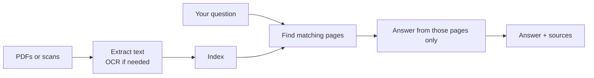

<div align="center">

# Pharma Doc QA

Ask questions of pharmaceutical documents.  
Get answers grounded in the page — with sources you can check.

[](https://github.com/jelo-ca/pharma_rag/actions/workflows/ci.yml)


</div>

---

Safety data sheets, batch protocols, supplier packs, and FDA correspondence are long, mixed, and often scanned. **Pharma Doc QA** lets you upload those files and ask in plain language — storage conditions, lot numbers, BSE/TSE status, manufacturer, first aid — then shows the exact file and page the answer came from.

If the documents do not contain the answer, it says so. It does not fill gaps from general knowledge.

## What you can do

- **Upload a document pack** — one PDF or many, including scanned pages
- **Ask in everyday language** — no special query syntax
- **Read sourced answers** — file name, page number, and confidence for every claim
- **Preview the original PDF** next to the chat
- **Keep documents on your machine** when you run a local or Ollama model

Typical questions:

> What are the storage conditions?  
> What is the batch number?  
> Is there a BSE/TSE declaration?  
> Who is the manufacturer?  
> What first aid measures apply for skin contact?

## Why it is built this way

Pharmaceutical Q&A is only useful if the answer is **auditable**. Every response is generated from retrieved passages, not from the model's prior knowledge. Each answer ships with the chunks that supported it, so a reviewer can open the page and confirm.

| Capability | What it means for you |
| --- | --- |
| Grounded answers | If it is not in the files, you get *“This information is not available in the provided documents.”* |
| Page-level sources | File, page, document type, and a confidence score on every result |
| Digital and scanned | Native PDF text, plus OCR fallback for image-only pages and photo folders |
| Document-type awareness | Cover letters, CoAs, SDS, packaging specs, BSE/TSE, and more |
| Your choice of model | Local GGUF, [Ollama](https://ollama.com), or Gemini |

## How it works



Under the hood, retrieval combines semantic search with keyword search and fuses the two, so both exact identifiers (lot numbers, CAS codes) and paraphrased questions land on the right page.

## Try the app

The fastest path is the Gradio chat in [`notebooks/rag.ipynb`](notebooks/rag.ipynb):

1. Upload one or more PDFs
2. Click **Build Index**
3. Ask a question
4. Inspect **Sources**, the **Index**, and the **Document** preview

A Colab-ready copy lives in [`notebooks/rag_colab.ipynb`](notebooks/rag_colab.ipynb).

### Setup

```bash
python -m venv .venv

# Windows PowerShell
.venv\Scripts\Activate.ps1

# macOS / Linux
source .venv/bin/activate

pip install -e .
```

Create a `.env` in the project root:

```env
# Required — used to classify pages into pharma document types
GEMINI_API_KEY=your-key-here

# How answers are generated: local | ollama | gemini
LLM_PROVIDER=local

# Required when LLM_PROVIDER=local — path to a GGUF file
MODEL_PATH=C:\path\to\mistral-7b-instruct-v0.2.Q4_K_M.gguf
N_GPU_LAYERS=-1
```

| Provider | When to use it |
| --- | --- |
| `local` | A GGUF model on disk. Documents and generation stay on-device. GPU offload with `N_GPU_LAYERS=-1`, or `0` for CPU. |
| `ollama` | A running [Ollama](https://ollama.com) server. Set `OLLAMA_MODEL` (default `mistral`) and optionally `OLLAMA_BASE_URL`. |
| `gemini` | Cloud generation with the same Gemini key used for classification. |

Scanned PDFs and image folders also need [Tesseract OCR](https://github.com/tesseract-ocr/tesseract) installed and on your PATH.

Then open the notebook and launch the UI.

## Use it from Python

```python
from rag import RAGPipeline

rag = RAGPipeline(persist_dir="./storage")
rag.build("path/to/document.pdf", classify_docs=True)

result = rag.query_with_sources(
    "What are the storage conditions?",
    classify=True,
)

print(result["answer"])
for source in result["sources"]:
    print(f"{source['file']}  p.{source['page']}  {source['score']}%")
```

Several files at once:

```python
rag.build_from_multiple_pdfs(
    ["sds.pdf", "coa.pdf", "cover_letter.pdf"],
    classify_docs=True,
)
```

A folder of scanned page images (PNG, JPG, TIFF, BMP, GIF):

```python
rag.build_from_images("path/to/scans", classify_docs=True)
```

Answers stream token-by-token with `stream_query_with_sources(...)`. Save the index with `persist_dir` so you do not rebuild on every run.

## Document types

When classification is on, pages are labelled so questions can be scoped to the right kind of document:

| Type | Examples |
| --- | --- |
| Cover letter | Transmittal letters, enclosed-documentation notes |
| Certificate of quality | CoA, batch / lot release |
| Packaging specification | Container, label, and closure specs |
| BSE/TSE declaration | Animal-origin statements |
| Material description | SDS / MSDS, product descriptions |
| Supplier qualification | Vendor audits, approved-supplier records |
| Chain of custody | Custody-transfer records |
| Unclassified | Anything that does not match the above |

## For developers

`RAGPipeline` is the public API (`src/rag/pipeline.py`).

| Method | Role |
| --- | --- |
| `build` / `build_from_multiple_pdfs` / `build_from_images` | Ingest and index |
| `query` | Plain-text answer |
| `query_with_sources` | Answer, sources, timings |
| `stream_query_with_sources` | Token stream + sources |
| `get_stats` / `get_document_details` | Index inventory |
| `clear_cache` | Drop the query cache |

```bash
pytest -m unit          # no model or OCR required
pytest                  # full suite; integration tests need a GGUF model
pylint src
```

Regression and baseline comparison live in `scripts/run_regression.py` and `scripts/compare_baseline.py`. A worked multi-file script is in `src/rag/demos/multi_file.py`.

## Troubleshooting

**`GEMINI_API_KEY is required for the document classifier.`**  
Set `GEMINI_API_KEY` in `.env`. Classification uses Gemini even when answers are generated locally.

**`FileNotFoundError: GGUF model not found`**  
Point `MODEL_PATH` at a real `.gguf` file, or switch `LLM_PROVIDER` to `ollama` or `gemini`.

**Scanned pages come back empty**  
Install Tesseract, confirm `tesseract` is on PATH, and that `pytesseract` plus `pillow` are installed.

**`RuntimeError: Pipeline not built`**  
Call `build`, `build_from_multiple_pdfs`, or `build_from_images` before querying.

**Slow answers on CPU**  
Use GPU offload (`N_GPU_LAYERS=-1` with a CUDA build of `llama-cpp-python`), a smaller quantized GGUF, or `LLM_PROVIDER=ollama` / `gemini`.

## License

MIT
